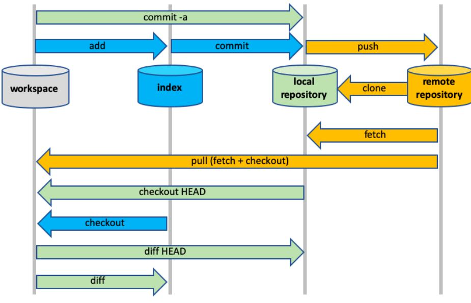

### [공부한 내용 정리](https://www.notion.so/GIT-cea8db01f88d4fee8123bec5922d9255)

1. [Git command 모음](https://www.notion.so/Git-command-4d6b23d60711485dbb0fd252c3a86874)
2. [Branch](https://www.notion.so/Branch-d85bef88b1554aeba8c4550ae2d67e89)
3. [Git 트러블 슈팅](https://www.notion.so/Git-ca6acabffd6f43c491f8335face544f7)
4. [Commit Message Convention](https://www.notion.so/Commit-Message-Convention-e7df510796824432ab542eab11a1d031)
5. [Git 기초 교육 - 오픈소스컨트리뷰톤](https://www.notion.so/Git-b87ddcbd54b9440684c220873c8522e6)
6. [GIT 고급 실습 - 오픈소스컨트리뷰톤](https://www.notion.so/GIT-0ad63bec4794440babb01f0f9dce4236)

---
## Git이란?

-  분산 버전 관리 도구로, 작업 내역을 저장할 수 있고 여러 사람과 협업할 때 필수적으로 쓰입니다.
- Git에는 `workspace`, `index`, `local repository`, `remote repository`의 4가지 공간이 있습니다.
- remote repository에서 최신 업데이트된 작업 내역을 받아옵니다.
- remote repository로는 GitHub, BitBucket, Gitlabs 와 같은 깃 호스팅 서비스를 사용합니다.


---

## Git 작업공간

- Git 작업 공간



- workspace
  -  작업을 하는 공간입니다.
  -  `git`을 쓰기 이전 처음 상태입니다.
  -  `git add` 명령어를 사용하기 전의 변경 사항들은 이곳에 기록됩니다.
    

- index
  - 흔히 `staging area` 라고 불립니다.
  - 변경되는 모든 파일 및 폴더들을 추척하는 공간입니다.
  - `git add` 명령어로 workspace 공간에 있는 작업물을 이 공간으로 보낼 수 있습니다.
  - 커밋하기 원하는 작업물을 이 공간에 두어야합니다.
  - 한 번 `index` 에 올라간 파일들은 `git`에서 계속해서 추적합니다.


- local repository
  - 최종적으로 커밋된 작업물이 놓이는 공간입니다.
  - `git commit` 명령어로 index에 있는 파일들을 이 곳으로 보낼 수 있습니다.
  - 최종적으로 작업 내용이 이곳에 기록됩니다.

- remote repository
  - Github의 원격 저장소입니다. 최종 작업물을 이곳에 저장하고 다른 사람과 공유합니다.
  - 여러 사람들과 협업하는 공간입니다.
  - `git push` 명령어로 local repository의 작업물들을 이 곳으로 보낼 수 있습니다.
  - `git fetch` 나 `git pull` 명령어로 이 곳에 있는 작업물을 local repository로 가져올 수 있습니다.
    - 보통 원격 저장소의 최신 변경 사항들을 local repository에 싱크하기 위해 사용됩니다.
  - 이 공간에 있는 작업물들을 보통 가장 최신 버전의 작업물이라 간주합니다.
  - `Github` , `BitBucket`, `Gitlab` 등이 이 공간을 구현한 호스팅 서비스입니다.

---

- 작업 공간별로 사용할 수 있는 git command 유형

```
git add : workspace -> index
git commit : index -> local repository
git push : local repository -> remote repository
git pull, fetch : origin repoistory -> remote repository

```


## **명령어**
[깃허브 command 공식문서](https://git-scm.com/docs)

### CONFIG

- 모든 로컬 리포지토리에서 사용되는 사용자 정보 구성

```bash
# 사용자명, 이메일 설정하기
git config --global user.name "USER NAME"
git config --global user.email "USER EMAIL"

# 자동 명령줄 색깔 설정
git config --global color.ui auto
```

- `git config` :  **git 설정**
    
    ```bash
    # git config 확인하기
    git config -l
    git config --global -l
    
    # git config 수정하기
    git config --global --edit
    
    # ile permission 무시하기
    # 리눅스는 chmod 로 퍼미션을 주는 게 git 에서 무시하게 설정한다
    git config core.fileMode false
    
    # Login credentials 캐쉬 설정
    git config --global credential.helper cache
    
    #.gitignore 수정 적용하기
    #.gitignore 로 git 에서 제외 시킬 수 있는데 
    #.gitignore 수정시에 다시 적용을 해줘야 한다
    
    git rm -r --cached .
    git add .
    git commit -m "gitignore fixed untracked files"
    ```
    

---

### SETUP & INIT

- 사용자 정보 구성, 리포지토리 초기화 및 복제

```bash
# 개발 folder 에서 init 하면 .git 폴더가 생기면서 git 이 설정됩니다
git init
git init PROJECT_NAME

# remote repository 를 복사해오기
git clone https://github.com/YOUR-USERNAME/YOUR-REPOSITORY
```

- `git init` 
    
- `git clone` 

---

### Repository

- github의 remote repository 연결

```bash
# remote repository 를 조회한다
git remote

# remote repository 의 주소도 조회한다
git remote -v

# origin 이라는 명칭으로 github 의 repository 가 정의됩니다
git remote add origin https://github.com/YOUR-USERNAME/YOUR-REPOSITORY

git remote show origin
```

- `git remote` :  원격 저장소에 관한 명령어
    
    ```bash
    # remote repository 를 복사해오기
    git clone https://github.com/YOUR-USERNAME/YOUR-REPOSITORY
    
    # github repository 로 소스 올리기
    git push -u REMOTE-NAME BRANCH-NAME
    
    git push -u origin master
    # origin 은 git remote add origin 에서 설정한 명칭 입니다
    
    # 혼자 쓰는 거면 이렇게 git push 만 처도 됨
    git push
    # git push -u origin master 와 동일하게 처리됨
    
    # 원격 브랜치 확인
    git branch -r
    
    # 원격 repository 와 local repository 병합하기
    
    # github repository 를 가져와서
    git fetch REMOTE-NAME
    # 로컬 repository 와 병합한다
    git merge REMOTE-NAME/BRANCH-NAME
    
    # 병합 없이 remote branch를 가져오기
    # 모든 리모트 정보를 업데이트 한다
    # fetch 수행됨
    git remote update
    
    # 원격 브랜치 삭제
    git push --delete REMOTE-NAME :BRANCH-NAME
    
    # 원격 브랜치 이름 변경하기
    git push origin :OLD-BRANCH-NAME NEW-BRANCH-NAME
    ```
    

---

### STAGE & SNAPSHOT

- 스냅샷 및 Git staging area 작업

```bash
# 브랜치 상태 확인
git status

# 변경된 파일 staging area로 추가
git add [file]

# file을 staging area에서 제외 
git reset [file]

# 변경됐지만 staging 되지 않은 파일
git diff

# staging 됐지만 커밋되지 않은 파일
git diff --staged

# 커밋
git commit -m "[descriptive message]"
```

- `git add` : **staging area 로 파일 추가**
    
    ```bash
    # staging area 로 파일 추가
    
    # 변경된 전체 파일 추가
    git add .
    
    # 변경된 1개 파일 추가
    git add FILE-NAME
    
    # PATH 내의 변경된 파일 추가
    git add FILE-PATH
    
    ```
    
- `git commit` : **staging area의 내용을 커밋**
    
    ```bash
    # editor 로 commit message 작성
    git commit
    # command line 으로 commit message 작성
    git commit -m "COMMIT-MESSAGE"
    
    # tracked files 을 add 하고 commit 을 동시에 한다
    git commit -a -m "COMMIT-MESSAGE"
    
    # 자체서명 commit 을 만든다
    git commit -as
    git commit -as -m "commit message"
    
    ------------------------------------------------------
    # 최근 commit 수정
    
    # overhead commit 을 변경한다
    # commit hash 가 바뀜
    git commit --amend -a
    # HEAD 의 commit 메시지만 변경 한다
    git commit --amend -m "CHANGE-COMMIT-MESSAGE"
    
    ------------------------------------------------------
    # 마지막 commit 으로 원상복구
    git revert HEAD
    
    # 되돌릴 COMMIT-ID 로 Revert 한다 
    git revert COMMIT-ID
    # 또는
    # HEAD~3 최근 3개 전의 commit 으로 Revert 한다
    git revert --no-commit HEAD~3
    git commit -m "Revert Comit A,B,C"
    
    -------------------------------------------------------
    # commit 다시하기
    
    git reset HEAD~
    git add <filename1>
    git commit
    
    ```
    
- `git diff` : **commit 전에 변경내역을 확인**
    

    ```bash
    # unstaged changes 와 비교한다
    # add 로 추가되지 않은 변경된 소스코드를 보여준다
    # working directory 와 Index 를 비교
    git diff
    
    git diff filename
    
    # staged changes 와 비교한다
    # add 로 추가된 소스코드를 커밋로그 첫번째(HEAD)와 비교해준다
    # index 와 HEAD 를 비교
    git diff --staged
    
    # 브랜치 변경을 동기화
    # 변경사항 확인
    git diff --cached 
    
    # working directory 와 HEAD 를 비교
    git diff HEAD
    
    # working directory 와 HEAD^ 를 비교
    git diff HEAD^
    ```
    

---

### Branch & Merge

- branch 내 작업 격리, 컨텍스트 변경 및 변경 통합

```bash
# 브랜치 리스트 출력
git branch

# 새로운 branch 생성
git branch [branch-name]

# 브랜츠 전환
git checkout NEW-BRANCH-NAME

# 현재 브랜치(main)에서 new_branch 라는 새로운 브랜치를 만듭니다.
git switch -c new_branch

# 위 명령어는 사실 git switch -c [new_branch] main과 동일합니다.
# git switch -c {새로운 브랜치 이름} {기준 브랜치} 이 명령어 포맷입니다.
# 뒤에 {기준 브랜치}는 생략 가능하며, 생략할 시 현재 브랜치를 기준으로 새로운 브랜치가 만들어집니다.

# [branch] 브랜치를 현재 브랜치(main)에 합칩니다.
git merge [branch]

# 현재 branch의 모든 commit을 출력합니다
git log
```

- `git branch`: **독립된 작업영역**
    
    ```bash
    # 브랜치 리스트 조회
    git branch
    git branch --list
    
    # 브랜치 삭제
    git branch -d BRANCH-NAME
    # 강제로 브랜치 지우기
    git branch -D BRANCH-NAME
    
    # 브랜치 병합
    
    #현재 브랜치에 BRANCH-NAME 을 병합한다
    git merge BRANCH-NAME
    
    # 병합된 브랜치 리스트 조회
    
    # 현재 브랜치에 병합된 브랜치 리스트를 보여준다
    git branch -a --merged
    
    # 브랜치 병합을 원상복구한다.
    git merge --abort
    
    # 브랜치 이름을 변경한다
    git branch -m OLD-BRANCH-NAME NEW-BRANCH-NAME
    
    ```
    

---

### INSPECT & COMPARE

- log, Diff 및 개체 정보 검사

```bash
# 현재 브랜치의 커밋 기록 표시
git log

# branch B에 없는 branch A의 커밋을 표시
git log branchB..branchA

# 이름이 바뀌어도 변경된 [file] 커밋 표시
git log --follow [file]

# branch B에는 없지만 branch A에는 있는 차이를 표시
git diff branchB...branchA

# 사람이 읽을 수 있는 포맷으로 Git의 모든 object를 표시
git show [SHA]
```

- `git log`
    
    ```bash
    # commit history 를 본다
    git log
    
    # commit의 변경 내용까지 확인
    git log -p
    
    # NUMBER 갯수 만큼 log 를 보여줌
    git log -NUMBER
    
    # log 를 한줄로 보여줌
    git log --oneline
    
    # log 를 커밋해시와 저자만 보여줌
    git log --pretty=format:"%H, %an"
    
    # merge 된 브랜치 그래프를 보여줌
    git log --oneline --decorate --graph --all
    
    # first hash 부터 last hash 까지 commit log 를 보여줌
    git log <first_commit_hash>~..<last_commit_hash>
    
    # commit hash 의 log 만 보여줌
    git log <commit_hash>~..<commit_hash>
    
    # commit hash 의 commit 내용을 보여줌
    git show <commit_hash>
    
    # log stats 를 조회한다
    git log --stat
    ```
    
- `git diff`
    
    ```bash
    # unstaged changes 와 비교한다
    # add 로 추가되지 않은 변경된 소스코드를 보여준다
    # working directory 와 Index 를 비교
    git diff
    
    git diff filename
    
    # staged changes 와 비교한다
    # add 로 추가된 소스코드를 커밋로그 첫번째(HEAD)와 비교해준다
    # index 와 HEAD 를 비교
    git diff --staged
    git diff --cached
    
    # working directory 와 HEAD 를 비교
    git diff HEAD
    
    # working directory 와 HEAD^ 를 비교
    git diff HEAD^
    ```
    

---

### TRACKING PATH CHANGES

- Versioning file removes and path changes

```bash
# tracked files 에서 삭제
git rm [filename]

# 기존 파일 경로 변경 및 이동 준비
git mv [existing-path] [new-path]

# 이동한 경로를 나타내는 모든 커밋 로그 표시
git log --stat -M

```

- `git rm`
    
    ```bash
    # tracked files 에서 삭제
    git rm [filename]
    
    # 파일 이름 변경
    git mv oldfile newfile
    ```
    
- `git clean`
    
    ```bash
    # untracked 파일 또는 폴더 제거하기
    
    # To remove untracked files
    git clean -f
    # TO remove untracked directories
    git clean -fd
    ```
    

---

### IGNORING PATTERNS

- 특정 파일에 대해 staging 혹은 commit 무시

```bash
# Save a file with desired paterns as .gitignore with either direct string
# matches or wildcard globs.

logs/
*.notes
pattern*/

# system wide ignore patern for all local repositories
git config --global core.excludesfile [file]
```

---

### SHARE & UPDATE

- 다른 리포지토리에서 업데이트 검색 및 로컬 리포지토리 업데이트

```bash
# [url] 주소에 있는 원격 저장소를 [alias]로 저장 
git remote add [alias] [url]

# remote 저장소로 부터 모든 branch를 가져옴
git fetch [alias]

# remote branch를 현재 branch에 병합하여 최신 상태로 갱신
git merge [alias]/[branch]

# 현재 branch의 commit 내용을 remote repository branch에 전송 
git push [alias] [branch]

# tracking remote branch로부터 모든 commit을 fetch, merge 함
git pull
```

- `git pull` : **원격 브랜치의 최신정보 가져오기**
    
    ```bash
    # pull = fetch + merge
    # git pull origin master
    git pull REMOTE-NAME BRANCH-NAME
    
    # 원격 저장소에서 다운만 한다 (merge 는 따로 해야 한다)
    git fetch REMOTE-NAME
    # 가져온 정보를 로컬브랜치와 비교 하고 직접 병합 해준다
    # git diff HEAD origin/master
    # git log --decorate --all --oneline
    # git merge origin/master
    
    # 모든 리모트 정보를 업데이트 한다
    # fetch 수행됨
    git remote update
    
    ```
    
- `git fetch` :
    
    
- `git merge` :
- `git push` :

---

### PRUNE

- remote repository의 삭제된 브랜치도 로컬 저장소에서 삭제한다.
- local에서 remote를 참조하는 것 중 유효하지 않은 것을 제거한다.

```bash
# 새로 추가되었거나 삭제된 리모트 브랜치의 정보를 최신화 한다
git remote prune REMOTE-NAME

# 리모트 저장소에서 삭제된 브랜치를 로컬 저장소에도 적용
git pull --prune
git fetch --prune

git prune

# 옵션으로 적용도 가능하다
git config --global fetch.prune true
```

- `git prune` :
    
    ```bash
    
    ```
    

---

### REWRITE HISTORY

- 작업 기록을 수정하는 경우

```bash
# 현재 branch의 모든 commit을 지정한 [branch]보다 먼저 적용
apply any commits of current branch ahead of specified one
git rebase [branch]

# staging area를 지우고 지정된 [commit]부터 작업 트리를 재작성
git reset --hard [commit]
```

- `git reset`: 변경사항 복구
    
    ```bash
    # 파일 원상복구
    
    # revert unstaged changes
    git checkout filename
    
    # revert staged changes
    git reset HEAD filename
    git reset HEAD -p
    
    # 마지막 commit 으로 reset 하기
    git reset -hard origin/BRANCH-NAME
    
    # 모든 변경사항 취소하기
    git reset --hard
    
    # # unstage 로 원복
    git reset <file_path>
    
    ----------------------------------------------------
    # 원격 저장소의 커밋 되돌리기 (Reset : 히스토리가 망가짐)
    
    # overhead commit 으로 Reset 한다
    git reset --hard
    git reset --hard HEAD
    
    # 되돌릴 COMMIT-ID 로 Reset 한다
    git reset --hard COMMIT-ID
    # 또는
    # 바로 이전 commit 으로 Reset 한다
    git reset --hard HEAD^
    # 또는
    # HEAD~3 최근 3개 전의 commit 으로 Reset 한다
    git reset --hard HEAD~3
    
    # 바로 전으로 reset 한다
    git reset --hard HEAD~
    
    # 원격저장소에 안전하게 넣는다
    git push --force-with-lease
    # 또는
    # 강제로 원격저장소에 넣는다
    git push --force
    ```
    
- `git rebase` :
    
    ```bash
    # commit history 변경
    git rebase BRANCH-NAME
    git rebase -i BRANCH-NAME
    ```
    

---

### TEMPORARY COMMITS

- branch를 변경하기 위해 수정된 tracked file을 임시로 저장

```bash
# 수정 및 스테이징된 변경 내용 저장
git stash

# stash 목록 출력
git stash list

git stash pop

# discard the changes from top of stash stack
git stash drop
```

- `git stash`:
    
    ```bash
    # 변경저장
    # 체크아웃 에러 발생시에 commit 전 상태를 저장해 둔다.
    git stash
    
    # stash list 를 본다
    git stash list
    ```
    

---

- `git cherry-pick` :  **다른 브랜치에 commit 이동**
    
    ```bash
    # 다른 브랜치의 commit 을 가져올 수 있는데 충돌날 가능성이 많아서 잘 사용하지 않는다
    git cherry-pick COMMIT-HASH
    ```
    

---

- `git show-ref` : 커밋 해쉬 정보
    
    ```bash
    git show-ref HEAD
    git show-ref HEAD -s
    git show-ref master
    ```
    

---

- `git patch`
    
    ```bash
    # patch 를 적용한다
    git am <patch1> <patch2>
    # patch 를 취소한다
    git am --abort
    
    # conflicts 발생시 하나 이상의 patch 를 적용한다
    git am -3 <patch1> <patch2> ...
    
    # conflicts 해결 후에 patch 를 계속 한다
    git am --continue
    
    # overhead commit 으로 부터 patch 를 생성한다
    git format-patch HEAD~
    
    # n 개 전의 commit 으로 부터 patch 를 생성한다
    git format-patch HEAD~n
    ```
    

- git add / commit / push 취소하기
    
    [[Git] git add 취소하기, git commit 취소하기, git push 취소하기 - Heee's Development Blog](https://gmlwjd9405.github.io/2018/05/25/git-add-cancle.html)
    

---
