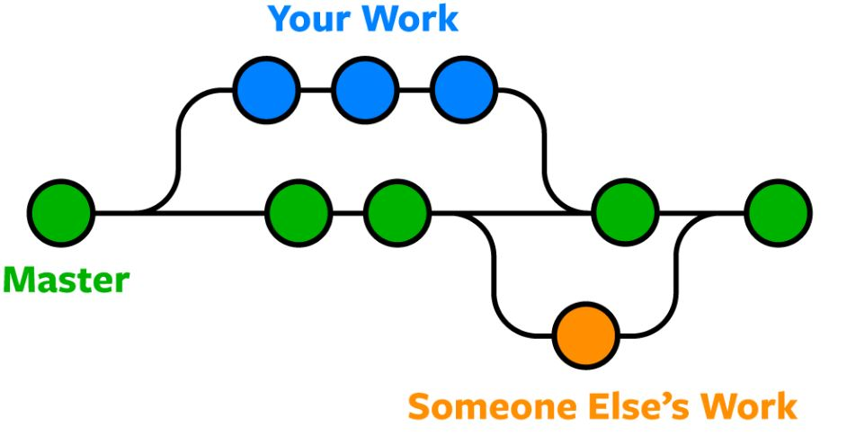

# 브랜치

- `브랜치` 는 사용자가 독립적으로 작업을 진행할 수 있는 작업 흐름입니다. 

- 하나의 브랜치는 독립된 `workspace` , `index` , `local repository` , `remote repository` 공간을 가집니다.

- 브랜치를 사용하면 하나의 프로젝트에서 여러 사람이 동시에 본인의 작업을 진행할 수 있습니다.

# 작업 흐름

- 한 프로젝트에서 여러명의 개발자가 협업하는 경우
  
- 각 개발자는 메인 브랜치에서 각자 자신이 작업할 새로운 브랜치를 만듭니다.

- 각 개발자는 본인이 만든 브랜치 위에서 작업합니다.

- 작업을 완료하면 remote repository로 작업 브랜치를 푸시합니다.
- remote repository에서 메인 브랜치로 Pull request를 합니다.
- 다른 개발자에게 코드 리뷰를 받습니다.
- 리뷰를 마치면 최종적으로 메인 브랜치에 머지합니다.

----

`git switch -c`  